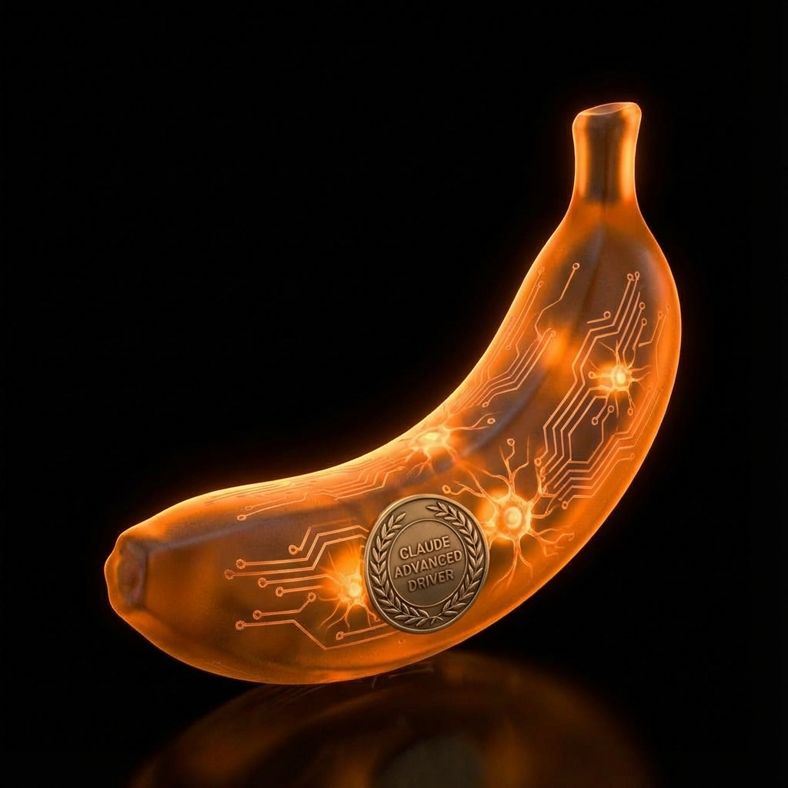

# Gemini Image Generation - Claude Skill

A Claude skill for generating and editing professional images using Google's Gemini API (`gemini-3-pro-image-preview`).

<div align="center">
  
  <p><em>Example: AI-generated image created with this skill</em></p>
</div>

## Features

- **Text-to-Image Generation** - Create images from text descriptions
- **Image Editing** - Modify existing images with text instructions
- **Style Templates** - Apply consistent styling using markdown templates
- **Reference Images** - Use up to 14 reference images for style/composition guidance
- **Batch Processing** - Generate multiple variations in one command
- **8 Aspect Ratios** - 1:1, 3:4, 4:3, 4:5, 5:4, 9:16, 16:9, 21:9
- **Auto-Install Dependencies** - First run automatically installs required packages
- **Bundled Blue Glass 3D Style** - Production-ready style template with examples

## Quick Start

### 1. Get Your API Key

1. Visit https://aistudio.google.com/apikey
2. Sign in and create a new API key
3. **Recommended:** Upgrade to paid tier to avoid rate limits

### 2. Set Your API Key

**Option A: Environment Variable (Recommended)**
```bash
# Linux/macOS - add to ~/.bashrc or ~/.zshrc
export GOOGLE_AI_API_KEY="your_key_here"

# Windows PowerShell - add to $PROFILE
$env:GOOGLE_AI_API_KEY="your_key_here"
```

**Option B: .env File**
```bash
# Create .env in your working directory
echo "GOOGLE_AI_API_KEY=your_key_here" > .env
```

### 3. Install uv (Package Manager)

```bash
# Linux/macOS
curl -LsSf https://astral.sh/uv/install.sh | sh

# Or via Homebrew
brew install uv
```

### 4. Generate Your First Image

```bash
cd /path/to/gemini-image-gen/scripts
uv run python main.py output.png "A vibrant sunset over mountains"
```

**First run:** Dependencies auto-install (~10 seconds), then run command again
**Subsequent runs:** Images generate immediately

## Usage Examples

### Basic Generation

```bash
uv run python main.py output.png "A simple 3D cube on black background" --aspect 1:1
```

### Blue Glass 3D Style (Bundled Template)

```bash
uv run python main.py rocket.png "rocket" \
  --style ../assets/styles/blue_glass_3d.md
```

**Result:** Frosted royal blue glass (#1e3a8a) with electric cyan (#00D4FF) rim lighting on solid black background

### Batch Processing (Multiple Icons)

```bash
uv run python main.py icon.png "cube" "sphere" "pyramid" \
  --style ../assets/styles/blue_glass_3d.md \
  --aspect 1:1
```

**Output:** `icon_1.png`, `icon_2.png`, `icon_3.png`

### With Reference Images (Maximum Consistency)

```bash
uv run python main.py database.png "database" \
  --style ../assets/styles/blue_glass_3d.md \
  --ref ../assets/styles/examples/1.png \
  --ref ../assets/styles/examples/2.png
```

### Edit Existing Image

```bash
uv run python main.py edited.png "Change background to solid blue (#0066CC)" \
  --edit original.png
```

### Different Aspect Ratios

```bash
# YouTube thumbnail
uv run python main.py thumb.png "AI tutorial thumbnail" --aspect 16:9

# Instagram post
uv run python main.py insta.png "Product photo" --aspect 1:1

# Vertical video
uv run python main.py story.png "Mobile design" --aspect 9:16
```

## Command Reference

```bash
uv run python main.py <output> <prompts...> [OPTIONS]

Arguments:
  <output>      Output file path (e.g., output.png, images/icon.png)
  <prompts...>  One or more subject prompts (multiple = batch processing)

Options:
  --style, -s   Path to style template .md file
  --edit, -e    Edit existing image instead of generating
  --ref, -r     Reference image (repeatable, up to 14 total)
  --aspect, -a  Aspect ratio (default: 16:9)
                1:1, 3:4, 4:3, 4:5, 5:4, 9:16, 16:9, 21:9
```

## Aspect Ratio Guide

| Ratio | Best For |
|-------|----------|
| **1:1** | Instagram posts, icons, profile pictures |
| **3:4** | Portrait photos, traditional prints |
| **4:3** | Landscape photos, older presentations |
| **4:5** | Instagram portrait posts (taller feed) |
| **5:4** | Instagram landscape posts |
| **9:16** | TikTok, Instagram Stories, vertical video |
| **16:9** | YouTube thumbnails, presentations, monitors |
| **21:9** | Ultra-wide, cinematic, website headers |

## Style Templates

### Using the Bundled Template

The skill includes a production-ready **blue glass 3D** style:

```bash
--style <skill-dir>/assets/styles/blue_glass_3d.md
```

**Characteristics:**
- Thick frosted royal blue glass (#1e3a8a)
- Sharp electric cyan (#00D4FF) rim lighting on top edges
- Soft internal volumetric glow
- Minimal mirrored reflection beneath objects
- Pure solid black background (#000000)

### Creating Custom Templates

Create a `.md` file with this structure:

```markdown
# Your Style Name

## Prompt Template

```
Your detailed prompt with {subject} placeholder.
Include explicit colors (#hex codes), materials, lighting, composition.
NO gradients, NO text, NO unwanted elements.
```
```

**Tips for good templates:**
- Use `{subject}` where variable content goes
- Specify exact colors with hex codes
- Front-load prohibitions: "NO gradients, NO fog, NO text..."
- Single dense paragraph works better than bullet points
- Be literal, not metaphorical

## Reference Images

### Understanding WHAT vs HOW

**Reference images define WHAT:**
- Shapes, icons, symbols to include
- Layout and composition
- Spatial arrangement

**Text prompts define HOW:**
- Visual style and aesthetics
- Materials (glass, metal, wood)
- Colors and lighting
- Background treatment

### Using Bundled Examples

```bash
--ref <skill-dir>/assets/styles/examples/1.png
--ref <skill-dir>/assets/styles/examples/2.png
```

The skill includes 5 blue glass 3D examples demonstrating style consistency across different subjects.

### Multiple References

Up to 14 reference images supported. Earlier references have stronger influence.

```bash
uv run python main.py output.png "subject" \
  --ref example1.png \
  --ref example2.png \
  --ref example3.png
```

## Tips & Best Practices

### For Best Results

1. **Be specific** - "Frosted royal blue glass (#1e3a8a)" not "blue glass"
2. **Use hex codes** - Precise colors for consistency
3. **Front-load prohibitions** - Start with "NO gradients, NO fog..."
4. **Choose right aspect ratio** - Match your intended use case
5. **Start with 1-2 references** - Add more only if needed

### For Iterative Workflows

⚠️ **Avoid gradients** if you plan to iterate on images

**Why:** Gradients compound compression artifacts through multiple generations

**Solution:**
- Use **solid backgrounds** for iterable elements
- Generate gradients **last** (no further iteration)
- Or generate foreground + background **separately**, composite externally

### For Batch Processing

1. Generate similar assets together for efficiency
2. Use style templates for consistency
3. Review all outputs, regenerate outliers individually
4. Use successful outputs as references for refinements

### For Production Use

1. **Upgrade to paid tier** - Avoid free tier rate limits
2. **Monitor usage** - Check dashboard at https://aistudio.google.com/
3. **Set up environment variables** - More secure than .env files
4. **Rotate API keys periodically** - Security best practice

## Troubleshooting

### Dependencies Won't Install

```
Error: 'uv' command not found
```

**Solution:** Install uv first:
```bash
curl -LsSf https://astral.sh/uv/install.sh | sh
# or: brew install uv
```

### API Key Not Found

```
Error: GOOGLE_AI_API_KEY not found in environment
```

**Solution:** Set your API key (see Quick Start section 2)

### Quota Exceeded

```
429 RESOURCE_EXHAUSTED - Quota exceeded
```

**Solution:**
- **Free tier:** Wait for quota reset or upgrade to paid tier
- **Paid tier:** Check usage limits at https://aistudio.google.com/

### Invalid Aspect Ratio

```
error: argument --aspect/-a: invalid choice: '5:3'
```

**Solution:** Use one of the 8 supported ratios:
`1:1, 3:4, 4:3, 4:5, 5:4, 9:16, 16:9, 21:9`

### File Not Found (Editing)

```
Error: Input image not found: logo.png
```

**Solution:**
- Verify filename is correct
- Use absolute path if file is not in current directory
- Check current directory: `ls -la`

### Python Version Error

```
requires-python = >=3.10
```

**Solution:** Upgrade to Python 3.10 or higher
```bash
python --version  # Check current version
```

## Advanced Usage

### Maximum Consistency (Template + Multiple References)

```bash
uv run python main.py icon.png "gear" \
  --style ../assets/styles/blue_glass_3d.md \
  --ref ../assets/styles/examples/1.png \
  --ref ../assets/styles/examples/2.png \
  --ref ../assets/styles/examples/3.png
```

Combines style template + multiple reference images for highest possible consistency.

### Iterative Refinement

```bash
# First generation
uv run python main.py v1.png "rocket" --style blue_glass_3d.md

# If good, use as reference for related icon
uv run python main.py v2.png "spaceship" \
  --style blue_glass_3d.md \
  --ref v1.png
```

### Separate Background Compositing

```bash
# 1. Generate foreground on solid black
uv run python main.py foreground.png \
  "Icon set on solid black (#000000)" \
  --style blue_glass_3d.md

# 2. Generate gradient background separately
uv run python main.py background.png \
  "Abstract gradient from deep blue to purple" \
  --aspect 16:9

# 3. Composite in Canva/Photoshop (no quality loss)
```

## File Structure

```
gemini-image-gen/
├── SKILL.md                      # Claude skill definition
├── README.md                     # This file
├── scripts/
│   ├── main.py                   # Image generation script
│   ├── pyproject.toml           # Python dependencies
│   └── .env                     # Your API key (create this)
├── assets/
│   └── styles/
│       ├── blue_glass_3d.md    # Bundled style template
│       └── examples/            # 5 reference images
│           ├── 1.png
│           ├── 2.png
│           ├── 3.png
│           ├── 4.png
│           └── 5.png
└── references/
    ├── api_capabilities.md      # Detailed API reference
    └── best_practices.md        # Prompt engineering guide
```

## Additional Resources

### Documentation

- **API Capabilities** (`references/api_capabilities.md`) - Complete API reference, limits, error codes
- **Best Practices** (`references/best_practices.md`) - Prompt engineering, gradient degradation lessons, template design
- **SKILL.md** - Full skill documentation for Claude integration

### External Links

- **Get API Key:** https://aistudio.google.com/apikey
- **Check Usage:** https://ai.dev/usage
- **Gemini API Docs:** https://ai.google.dev/gemini-api/docs
- **uv Package Manager:** https://github.com/astral-sh/uv

## Security Notes

- **Never commit `.env` files** to version control
- Add `.env` to `.gitignore`
- Use environment variables for production deployments
- Rotate API keys periodically
- Monitor usage dashboard regularly

## Requirements

- **Python:** 3.10 or higher
- **uv:** Package manager (auto-installs dependencies)
- **API Key:** Google AI API key (free or paid tier)
- **Dependencies:** Auto-install on first run
  - `google-genai>=1.0.0`
  - `python-dotenv>=1.0.0`
  - `pillow>=10.0.0`

## License

See main project for license information.

## Support

For issues, questions, or feature requests:
1. Check **Troubleshooting** section above
2. Review `references/api_capabilities.md` for API details
3. Review `references/best_practices.md` for usage tips
4. Check Google AI documentation: https://ai.google.dev/

---

**Quick Reference:**

```bash
# Basic generation
uv run python main.py output.png "your prompt" --aspect 16:9

# With style template
uv run python main.py output.png "subject" --style ../assets/styles/blue_glass_3d.md

# Batch processing
uv run python main.py icon.png "cube" "sphere" "pyramid" --style template.md

# With reference
uv run python main.py output.png "subject" --ref example.png --style template.md

# Edit image
uv run python main.py edited.png "change to blue" --edit original.png
```

**Remember:** First run auto-installs dependencies, then run command again to generate images!
